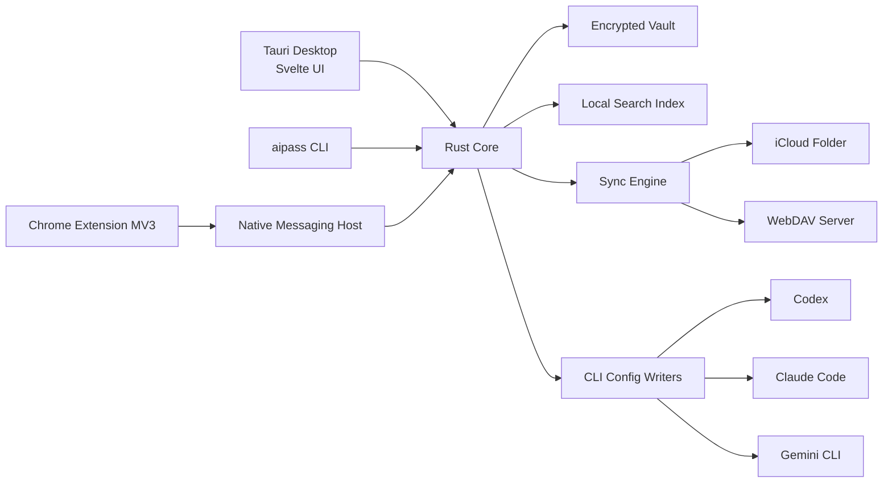

# AIPass 程序模块设计文档

## 1. 总体架构



核心原则：

- Rust core 是唯一能读取明文 secret 的层。
- UI、扩展、CLI 都通过 capability-scoped API 与 core 通信。
- 同步层只处理密文对象。
- Vault 文件、同步对象、备份、磁盘索引和日志都不能成为 secrets 的等价物；没有 master password 或已授权解锁会话时，复制这些文件不能恢复 API secrets。
- Provider registry 和 schemas 在 TS/Rust 间共享生成。

## 2. Monorepo 结构

```text
aipass/
  apps/
    desktop/
      src/
      src-tauri/
      static/
    extension/
      src/
      public/
      manifest.config.ts
    docs/
  crates/
    aipass-core/
    aipass-crypto/
    aipass-vault/
    aipass-index/
    aipass-sync/
    aipass-native-host/
    aipass-cli/
    aipass-config-writers/
    aipass-provider-registry/
  packages/
    ui/
    schemas/
    provider-registry/
    extension-shared/
    config-writers-js/
    tsconfig/
    eslint-config/
  .agents/
  turbo.json
  pnpm-workspace.yaml
  package.json
  LICENSE
```

### Turbo tasks

```json
{
  "tasks": {
    "build": { "dependsOn": ["^build"], "outputs": ["dist/**", "build/**", "target/**"] },
    "test": { "dependsOn": ["^build"], "outputs": [] },
    "lint": { "outputs": [] },
    "typecheck": { "dependsOn": ["^build"], "outputs": [] },
    "dev": { "cache": false, "persistent": true }
  }
}
```

## 3. Rust crates

### `aipass-crypto`

职责：

- Argon2id KDF。
- AEAD encrypt/decrypt。
- Secure random。
- Key wrapping/unwrapping。
- Per-record Data Encryption Key generation。
- Vault Epoch Key ratchet。
- TTL key destruction / cryptographic erasure primitives。
- Secret memory zeroization。
- Fingerprint 和 masked display。
- Encrypted backup envelope。
- Fake-key leak scan utilities。

API：

```rust
pub struct KdfParams { algorithm: KdfAlgorithm, memory_kib: u32, iterations: u32, parallelism: u32, salt: Vec<u8> }
pub struct KeyEnvelope { version: u16, kdf: KdfParams, wrapped_vault_key: Vec<u8> }
pub struct VaultEpoch { epoch: u64, key_id: KeyId, created_at: OffsetDateTime }
pub fn derive_master_key(password: &SecretString, params: &KdfParams) -> Result<MasterKey>;
pub fn advance_epoch(current: &VaultEpochKey, rng: &mut OsRng) -> Result<VaultEpochKey>;
pub fn generate_record_dek() -> Result<RecordDek>;
pub fn wrap_record_dek(epoch_key: &VaultEpochKey, dek: &RecordDek, aad: &[u8]) -> Result<WrappedDek>;
pub fn encrypt_record(key: &VaultKey, aad: &[u8], plaintext: &[u8]) -> Result<Ciphertext>;
pub fn decrypt_record(key: &VaultKey, aad: &[u8], ciphertext: &Ciphertext) -> Result<Vec<u8>>;
```

### `aipass-vault`

职责：

- Vault 文件格式。
- Record CRUD。
- Migration。
- Lock/unlock lifecycle。
- Audit events。

文件建议：

```text
vault/
  manifest.aipmanifest
  objects/
    2026/05/<record-id>.aipobj
  index/
    local-search.aipindex
  devices/
    <device-id>.json.enc
  audit/
    <date>.aipaudit
```

Record envelope：

```json
{
  "object_id": "rec_...",
  "vault_id": "vlt_...",
  "schema_version": 1,
  "crypto_version": 1,
  "record_type": "provider_entry",
  "device_id": "dev_...",
  "lamport": 42,
  "updated_at": "2026-05-24T00:00:00Z",
  "aad": { "record_type": "provider_entry" },
  "ciphertext": "base64..."
}
```

### `aipass-index`

职责：

- 本地搜索索引。
- 默认解锁后内存搜索索引。
- 可选磁盘索引必须整体加密，或只保存不可逆 token。
- Secret fingerprint 索引：后四位、HMAC fingerprint、用户 alias。
- HMAC key 来自 vault 内独立 index key，不能明文落盘。
- 索引可删除重建，不参与同步明文。

### `aipass-provider-registry`

职责：

- Provider definitions。
- Domain matchers。
- Key pattern/fingerprint rules。
- Interface/auth scheme probes。
- Favicon fallback。
- Browser detection hints。
- CLI config defaults。

Provider definition：

```json
{
  "id": "openai",
  "displayName": "OpenAI",
  "kind": "official",
  "domains": ["platform.openai.com", "api.openai.com"],
  "interfaces": ["openai_compatible"],
  "authSchemes": ["bearer"],
  "endpoints": [
    { "kind": "api", "url": "https://api.openai.com/v1" },
    { "kind": "console", "url": "https://platform.openai.com" }
  ],
  "keyPatterns": ["sk-..."],
  "toolDefaults": {
    "codex": { "envKey": "OPENAI_API_KEY" }
  }
}
```

Provider definitions must be provider-agnostic. Anthropic, Gemini, Azure OpenAI, Bedrock and custom HTTP providers keep their own interface and authentication semantics instead of being squeezed into an OpenAI-compatible shape.

### `aipass-sync`

职责：

- Local folder/iCloud/WebDAV provider。
- Object listing。
- ETag tracking。
- Conflict detection。
- Merge planner。
- Compaction。

同步算法：

1. Load local manifest。
2. List remote objects。
3. Compare object id + lamport + hash。
4. Download missing/newer encrypted objects。
5. Merge metadata in locked-safe way；需要解锁时延迟明文 merge。
6. Upload local pending encrypted objects with ETag/If-Match。
7. Record sync checkpoint。

冲突策略：

- 不同 entry: 自动合并。
- 同 entry 不同字段: 自动合并。
- 同 entry 同字段: 产生 conflict record，UI 展示选择。
- Secret 冲突: 永不自动覆盖，用户选择保留哪一个或创建 variant。

### `aipass-config-writers`

职责：

- Codex config writer。
- Claude Code settings writer。
- Gemini CLI settings/env writer。
- Backup、diff、rollback。
- Validate target tool installed。

写入原则：

- helper/wrapper 优先。
- 明文写 config/env 必须显式 `--mode plaintext`。
- 所有写入都产生 operation log 和 backup。

### `aipass-native-host`

职责：

- Chrome Native Messaging stdio protocol。
- 校验 allowed extension id。
- 管理 message schema、capabilities、nonce。
- 与 core IPC。

Message schema：

```ts
type NativeRequest =
  | { id: string; type: "ping"; protocolVersion: number }
  | { id: string; type: "context.lookup"; origin: string; url: string }
  | { id: string; type: "secret.fill"; entryId: string; fieldId: string; grantId: string }
  | { id: string; type: "secret.saveDetected"; payload: DetectedSecretDraft }
  | { id: string; type: "unlock.request"; reason: string };
```

### `aipass-cli`

职责：

- 用户命令。
- JSON output contract。
- 与 core 通信或直接加载 vault。
- Shell completions。
- Tool config orchestration。

## 4. Desktop app

### Tauri side

Plugins：

- `single-instance`
- `stronghold`
- `autostart`
- `deep-link`
- `window-state`
- `log`
- `opener`
- `shell` 仅限明确 scoped commands
- `fs` 仅限 vault/sync/config backup 路径

Commands：

```rust
#[tauri::command] fn vault_status() -> VaultStatus;
#[tauri::command] fn vault_unlock(password: SecretString) -> UnlockResult;
#[tauri::command] fn entries_search(query: SearchQuery) -> Vec<EntrySummary>;
#[tauri::command] fn entry_get(id: EntryId) -> EntryDetail;
#[tauri::command] fn secret_copy(id: EntryId, field: FieldId) -> CopyResult;
#[tauri::command] fn provider_probe(base_url: Url) -> ProbeResult;
#[tauri::command] fn tool_config_plan(tool: ToolId, entry: EntryId) -> ConfigPlan;
#[tauri::command] fn tool_config_apply(plan_id: PlanId) -> ApplyResult;
```

Security：

- 不给 WebView 任意文件系统权限。
- 不把 secret 返回给前端，copy/fill 由 Rust side 完成。
- Reveal 返回短期 token 或 masked display；必要时只返回一次性明文并带过期。

### Svelte side

Stores：

- `vaultState`
- `searchState`
- `selectionState`
- `syncState`
- `settingsState`
- `commandPaletteState`

Routes：

- `/unlock`
- `/app`
- `/settings/security`
- `/settings/sync`
- `/settings/integrations`
- `/conflicts`

## 5. Chrome extension

### 结构

```text
apps/extension/src/
  manifest.ts
  service-worker.ts
  content/
    detector.ts
    overlay.ts
  popup/
    Popup.svelte
  sidepanel/
  native/
    client.ts
  rules/
    provider-page-rules.ts
```

### Permissions

MVP：

- `nativeMessaging`
- `activeTab`
- `storage`
- host permissions 采用用户授权/known provider list，不默认 `<all_urls>`。

### Detection

Signals：

- URL/domain/path。
- Input labels: API key, token, secret key, base url。
- Visible copied key pattern。
- Known page selectors for official providers。
- New API/One API routes: token/channel/user/quota/settings。

Policy：

- 检测只生成 draft。
- 保存必须用户确认。
- 读取页面字段必须来自用户动作或明确 UI 状态。

## 6. API 与数据边界

Trust boundaries：

- Browser page → content script: untrusted DOM。
- Content script → service worker: extension internal but still validate。
- Service worker → native host: Native Messaging boundary。
- Native host → core: local IPC boundary。
- UI WebView → Rust commands: Tauri IPC boundary。
- Sync provider → local sync: untrusted remote storage。

Mitigation：

- JSON schema validation at every boundary。
- Message ids and protocol versions。
- Origin/domain verification。
- Capability grants with expiration。
- No secret in logs。
- Rate limit repeated reveal/copy/fill。

## 7. Sync 与 E2EE 细节

P0 security invariant：复制本地 vault、iCloud/WebDAV 同步目录、导出备份、搜索索引、日志或配置 backup，不能恢复任何 AI secret 或敏感 provider 配置。AIPass 的持久化文件默认只暴露最小路由元数据。

密钥层次：

```text
Master Password
  -> Argon2id
    -> Master Key
      -> unwrap Vault Key
        -> decrypt Record Keys / Records
Device Key
  -> stored in OS secure storage / Stronghold
  -> used only for local session convenience
```

Record encryption：

- 每个 record 独立 nonce。
- 每个 record 独立随机 Record DEK，不使用同一个长期内容密钥直接加密所有 records。
- Record DEK 由当前 Vault Epoch Key 包裹。
- AAD 包含 vault id、record id、schema version、record type。
- 任何 metadata 篡改导致 decrypt fail。
- record 明文包含完整业务语义：title、domain、endpoint/base URL、console URL、provider kind、auth scheme、interface type、tags、quota、notes、API keys、headers、model aliases。
- 对非 OpenAI-compatible provider，record 明文同样包含 provider-specific endpoint、console URL、auth scheme、interface type、region、api version、project id、organization id 等字段。

Epoch ratchet：

- Vault 维护单调递增 epoch。
- `VEK_n+1 = HKDF(random(32) || HKDF(VEK_n, "advance"), context)`。
- master password 修改、设备移除、疑似泄露、用户手动 rotate security state 后 advance epoch。
- active records 在后台逐步 rewrap/re-encrypt 到最新 epoch。
- expired objects、旧版本和临时授权在 TTL 到期后删除 wrapped DEK 或 TTL bucket key，实现 cryptographic erasure。
- 当前 epoch key 不能解密已销毁 key 的过期对象；旧 epoch key 不能解密新 epoch 产生的对象。

限制：

- 已经被攻击者复制走且包含旧 key 的备份无法远程吊销。
- 仍需长期读取的 active provider entries 不能单纯通过删除 key 自动过期；必须由用户确认删除或 rotation 后 re-encrypt。

允许明文的最小元数据：

- format version。
- crypto algorithm id。
- KDF params 和 salt。
- object id、object type。
- sync lamport/device id/hash。

不允许默认明文的字段：

- API key、token、secret headers。
- provider title、domain、endpoint/base URL、console URL。
- provider kind、auth scheme、interface type、tags、quota、notes。
- model aliases、tool config history。

同步密文命名：

```text
objects/<prefix>/<record_id>.<lamport>.<hash>.aipobj
snapshots/<snapshot_id>.aipsnap
checkpoints/<device_id>.json.enc
```

备份策略：

- 默认 `.aipass-backup` 是 encrypted vault snapshot。
- 明文导出默认关闭，必须 advanced 二次确认并重新输入 master password。
- 配置 writer 产生的 backup 如果包含原有明文 key，必须由 AIPass 加密保存。

## 8. 测试策略

Rust：

- crypto test vectors。
- vault migration tests。
- sync merge property tests。
- WebDAV mock server。
- config writer golden file tests。
- native messaging protocol tests。

TypeScript/Svelte：

- component tests。
- store unit tests。
- extension detector fixtures。
- Playwright desktop webview-like tests。

E2E：

- create vault → add provider → search → copy。
- extension detects fake provider console → save → desktop shows entry。
- configure Codex/Claude/Gemini into temp HOME → validate diff and rollback。
- sync two temp devices through local WebDAV mock → conflict resolution。

Security tests：

- grep logs/backups/extension storage for fake key pattern。
- locked vault rejects secret operations。
- invalid extension id rejected。
- tampered ciphertext fails decrypt。

## 9. Packaging

- Desktop: Tauri bundle for macOS dmg/app, Windows msi/nsis, Linux AppImage/deb/rpm。
- CLI: packaged alongside desktop and standalone binary。
- Native host manifest installed by desktop setup and repair command。
- Extension: Chrome Web Store package plus developer install docs。

## 10. Open-source 合规

- Root `LICENSE`: Apache-2.0。
- `NOTICE` 记录必要第三方 attribution。
- CI 执行 license audit。
- AGPL 项目只能作为兼容目标，禁止复制代码、样式、素材。
